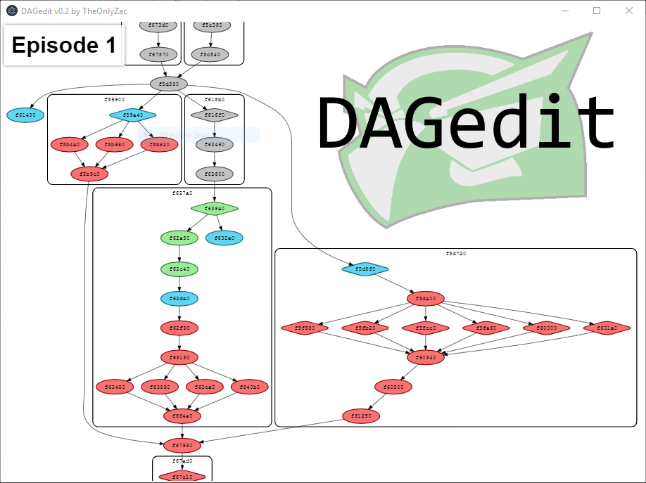

# DAGedit
A real-time save viewer for Sly 2, made with Electron.

## Features
* Explore the DAG and view node connections
* See the state of each task in real-time
* Nodes display their address in memory

## Planned Features
* Click on a node to edit its state
* Export the current DAG to a PNG or DOT language file
* Readable names based on in-game task descriptions

## Getting Started
To compile, run `npm run-script build`. You can also download a release version from the [Releases](https://github.com/TheOnlyZac/DAGedit/releases/) tab.

Make sure PCSX2 is running and Sly 2 NTSC is loaded, then run `DAGviewer.exe`. It will take a moment to populate the DAG.

When the window appears, if you do not see the graph, it is probably off screen. Zoom out with the scroll wheel, and click/drag to pan the graph.

## About the DAG
Each node corresponds to a task, and tasks are color coded by their state:
* Red: Unavailable (0)
* Blue: Available (1)
* Green: Complete (2)
* Gray: Final (3)

Diamond-shaped nodes have checkpoints. When you die, you respawn at the last focused checkpoint.

Each box/group of nodes is one job. Once a job is finished, all the Complete nodes are set to Final.

# Further Reading
For more information on the structure and function of the DAG, see [The Picture Worth a Thousand Bugs](https://youtu.be/Yl20uIQ3fEw), a GDC 2005 presentation by Bruce Oberg (lead programmer on Sly 2).