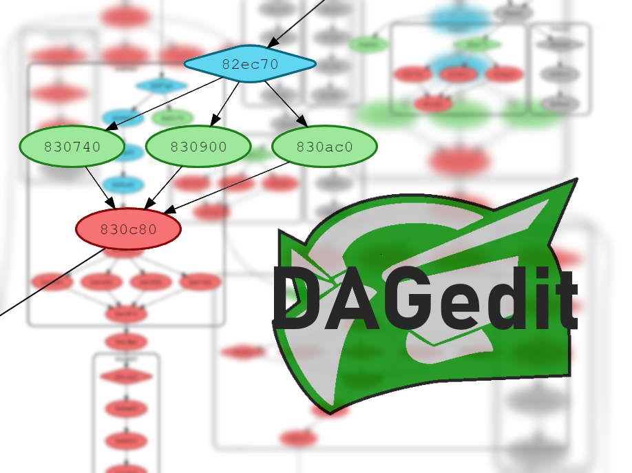

# DAGviz
A real-time game-state editor for Sly 2 and Sly 3.

## Features
* Explore the DAG view task connections
* See the state of each task in real-time
* Right-click a task to edit its state
* Export the graph to a DOT language file
* Export the current view to a PNG image

## Planned Features
* Plain-english node labels based on task descriptions
* Changes to DAG persist between reloads

## How to use
* `git clone https://github.com/theonlyzac/dagviz.git`
* `npm install` to install dependencies
* `npm start` to run the app

Use the scroll wheel to zoom in/out and click + drag to pan the current view.

Right click a node to see some options. From here you can copy the memory address of the node, change its state, or export the current DAG.

### Building
You can build an exe with `npm run-script build`. Release builds are available on the [Releases](https://github.com/TheOnlyZac/DAGedit/releases/) tab.

### Troubleshooting
Make sure PCSX2 is open and Sly 2 or 3 (NTSC) is running. It may take a moment to populate the DAG.

If it says the correct episode in the top-left but you do not see the DAG, it is probably off-screen. Zoom out with the scroll wheel, and/or click+drag to find it.

If it is not detecting that the game is running, uncheck the "Auto-detect build" box and set the game build manually. Please submit an issue saying which build and which map you were playing on.

## About the DAG
Each node corresponds to a task, and tasks are color-coded by their state:
* Red – Unavailable (0)
* Green – Available (1)
* Blue – Complete (2)
* Gray — Final (3)

By default, each node displays it's unique ID. You can change this using the "Nodes display" option.

Nodes do have descriptive plain-english names in the game's code, but as of now there is no method to extract those from the game, so the ID is the next best thing.

Diamond-shaped tasks have checkpoints. When you die, you respawn at the last targeted checkpoint.

Each box/cluster of tasks is one mission. Once a job is finished, all the Complete tasks in that job are set to Final.

# Further Reading
For more information on the structure and function of the DAG, see [The Picture Worth a Thousand Bugs](https://youtu.be/Yl20uIQ3fEw), a GDC 2005 presentation by Bruce Oberg (the lead programmer on Sly 2).
